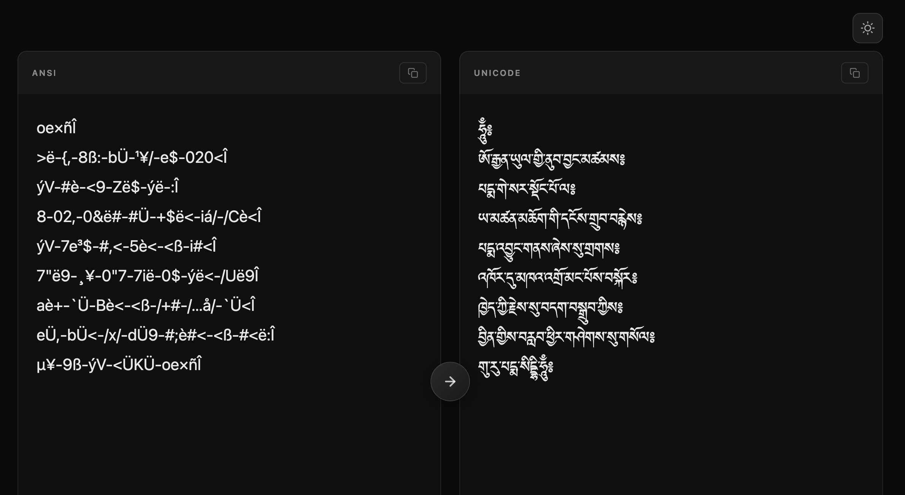
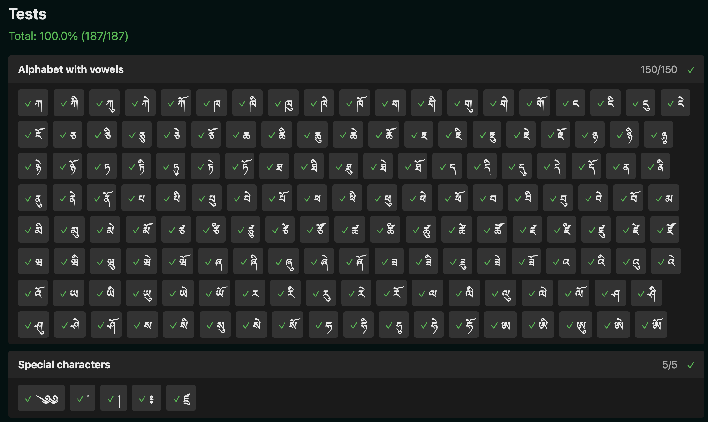

# tibetan-ansi-to-unicode-app

A naive attempt at converting ANSI Tibetan from TibetanChogyal to Unicode.

Almost all Tibetan characters should be properly transcoded but only a few
Sanskrit characters are currently handled.

This repo is just the web app, the actual library is at https://github.com/jerefrer/tibetan-ansi-to-unicode

## Testing

- Go to /`tests`
- Categories can be clicked to reveal their test cases.
- Tests are defined as regular JS tests [in the lib repo](https://github.com/jerefrer/tibetan-ansi-to-unicode), and just imported here to visualize them in a nicer interface.

## Credits

A zillion thanks to:

- Everybody involved in building an maintaining Vue.js, jQuery, SemanticUI,
  Sugar.js, Underscore.js, DevDocs, Zeal and Google Chrome for making web
  development so easy and enjoyable.

Through the virtue coming from this work, may all beings human and
otherwise reach absolute freedom.

## License

This software is licensed under the MIT License.

Copyright Padmakara, 2025.

Permission is hereby granted, free of charge, to any person obtaining a
copy of this software and associated documentation files (the
"Software"), to deal in the Software without restriction, including
without limitation the rights to use, copy, modify, merge, publish,
distribute, sublicense, and/or sell copies of the Software, and to permit
persons to whom the Software is furnished to do so, subject to the
following conditions:

The above copyright notice and this permission notice shall be included
in all copies or substantial portions of the Software.

THE SOFTWARE IS PROVIDED "AS IS", WITHOUT WARRANTY OF ANY KIND, EXPRESS
OR IMPLIED, INCLUDING BUT NOT LIMITED TO THE WARRANTIES OF
MERCHANTABILITY, FITNESS FOR A PARTICULAR PURPOSE AND NONINFRINGEMENT. IN
NO EVENT SHALL THE AUTHORS OR COPYRIGHT HOLDERS BE LIABLE FOR ANY CLAIM,
DAMAGES OR OTHER LIABILITY, WHETHER IN AN ACTION OF CONTRACT, TORT OR
OTHERWISE, ARISING FROM, OUT OF OR IN CONNECTION WITH THE SOFTWARE OR THE
USE OR OTHER DEALINGS IN THE SOFTWARE.
